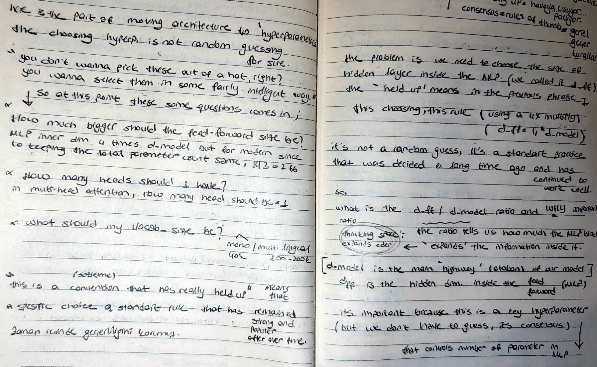

# 🌀 Positional Intelligence & Gated Units

## 📸 Reference Notes

Today, I tackled the "Position-Blind" nature of self-attention and implemented the latest activation functions used in models like Llama.

## 🔄 Rotary Positional Embeddings (RoPE)
I learned that the self-attention mechanism doesn't naturally know the order of words. 
- **The Solution:** I implemented **RoPE**, a mathematical method that encodes position into the word embeddings themselves.
- **Relative Position:** Instead of absolute positions, RoPE helps the model understand how words relate to each other based on their relative angle, making the attention mechanism much more efficient.

## 🧪 SwiGLU: The New Activation King
I moved away from simple activations like ReLU toward **Gated Units**:
- I implemented **SwiGLU**, which sends the input down two separate paths and multiplies them.
- I documented that while it increases the parameter count, it consistently works better and has become the dominant choice in modern AI research.
