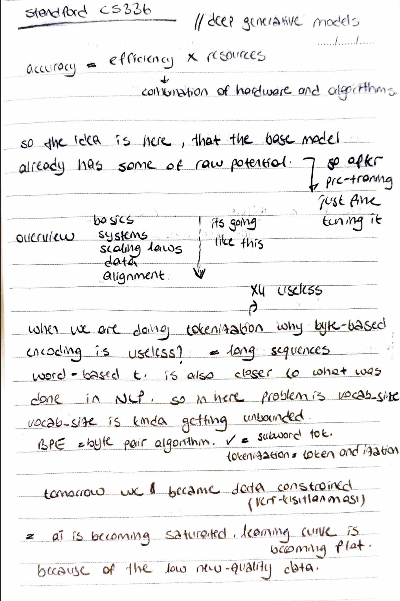

# Efficiency Metrics & The Tokenization Dilemma

I am starting my deep dive into Stanford's CS336. Today, I focused on the fundamental relationship between hardware, algorithms, and accuracy.

## 📸 Reference Notes

## 📉 The Efficiency Equation
I documented a core principle: **Accuracy = Efficiency x Resources**.
- I realized that high accuracy isn't just about having more data; it's a combination of optimized hardware and clever algorithms.
- I am using **MFU (Model FLOPs Utilization)** to measure how well I am "squeezing" the power out of my hardware. If I am at 5% MFU, it is considered really bad; I am aiming for something greater than 0.5.

## 🔤 Tokenization: Why BPE?
I analyzed different encoding methods and why the industry moved toward **Byte Pair Encoding (BPE)**:
- **Word-based:** The vocabulary size becomes unbounded and unmanageable.
- **Byte-based:** While simple, it results in extremely long sequences that are computationally expensive.
- **BPE (Consensus):** I implemented subword tokenization because it provides a perfect balance, keeping the vocabulary size controlled while handling rare words effectively.