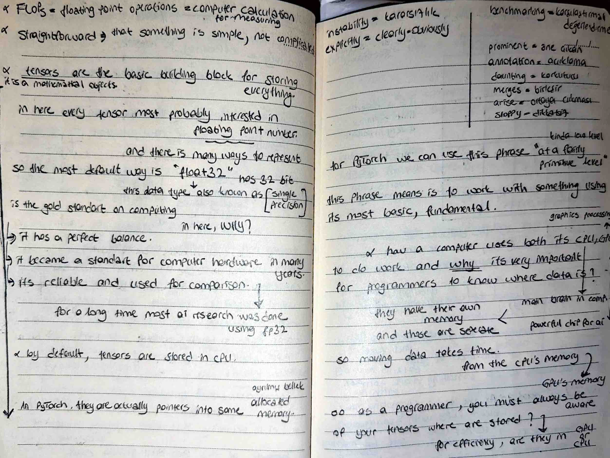
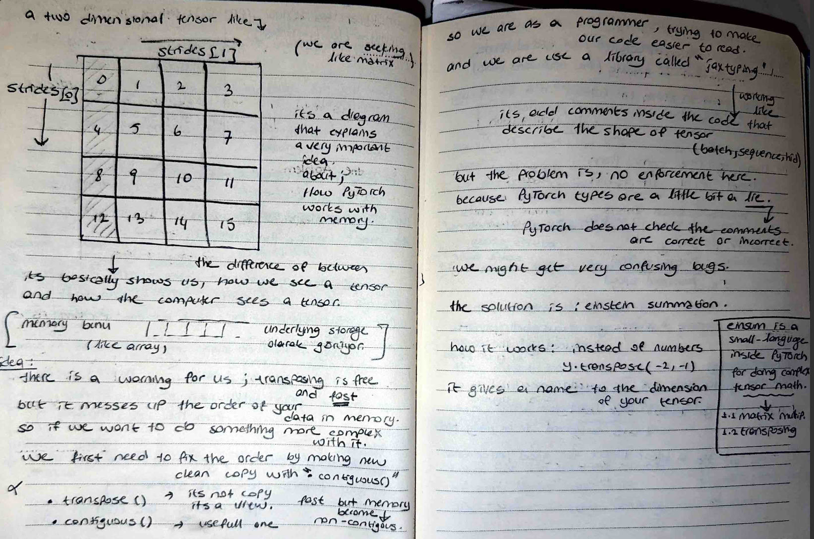

# 🧠 How Computers See Tensors - Strides & Memory

Today, I explored the "underlying storage" of tensors. I learned that as a programmer, I must always be aware of where my tensors are stored—CPU or GPU—and how they are laid out in memory.
## 📸 Reference Notes

## 🧊 Logical View vs. Memory Storage
I documented that while I see a 2D matrix, the computer sees a flat 1D array in memory.
- **Strides:** I used strides to understand how many steps the computer must take in memory to move to the next row or column.
- **The Transpose Trap:** I found that transposing a tensor is "free and fast" because it only changes the metadata (strides), not the actual data order. However, this makes the memory **non-contiguous**, which can mess up complex operations later.

## 🛠️ The Fix: Contiguous()
I implemented the `contiguous()` check. If I want to perform complex math after a transpose, I first need to fix the memory order by making a new clean copy.
