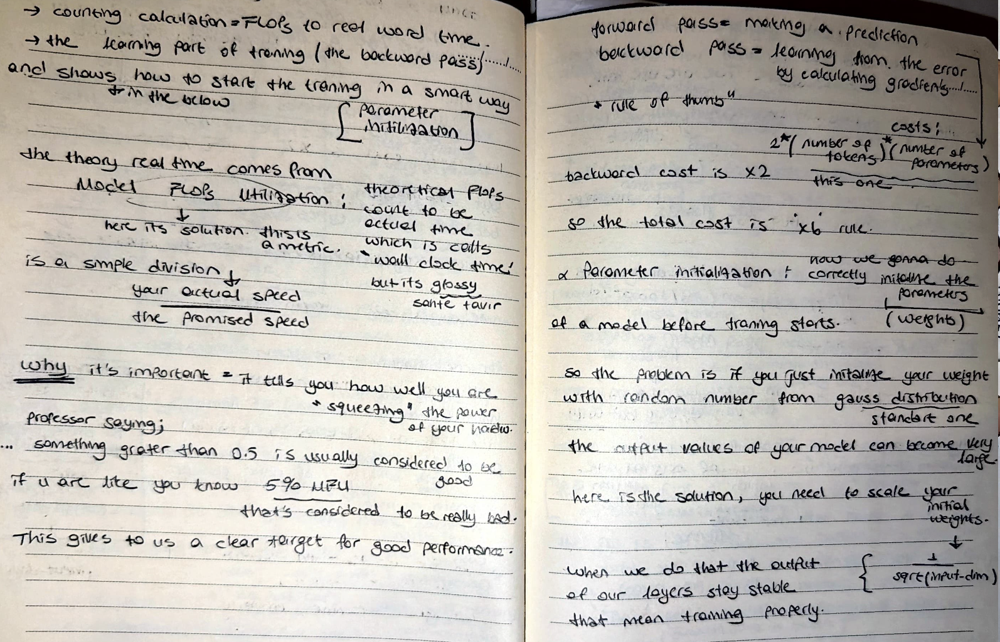

# 📉 Training Costs & Smart Parameter Initialization

I am moving into the "real-time" dynamics of training. Today, I calculated the actual cost of training a model and how to start that training in a smart way.

# 📸 Reference Notes

## 💰 The Rule of Thumb (x6 Rule)
I documented the "Gold Standard" for measuring training costs:
- **Forward Pass:** $2 \times (\text{number of tokens}) \times (\text{number of parameters})$.
- **Backward Pass:** This is $2 \times$ the cost of the forward pass.
- **Total Cost:** I am following the **x6 Rule** to estimate the total FLOPs required for a training run.

## ⚖️ Initialization Scaling
I realized that if I just initialize weights with random numbers from a standard Gaussian distribution, the output values can become dangerously large.
- **The Solution:** I am scaling my initial weights by $1/\sqrt{\text{input-dim}}$.
- **Result:** This keeps the output of my layers stable, ensuring the training starts properly without exploding gradients.

#