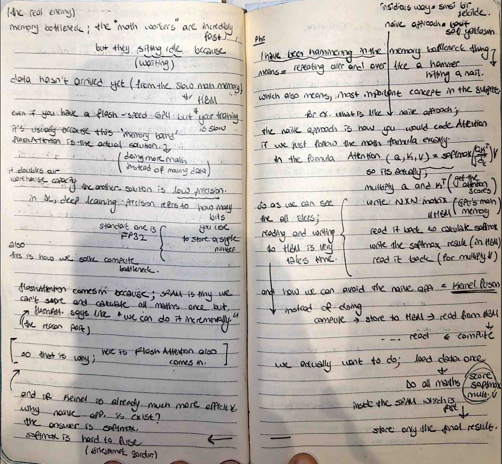

# The Memory Bottleneck & FlashAttention Intuition

Today, I identified the "real enemy" of high-performance code: the **Memory Bottleneck**. I documented how we can make models much faster not by doing less math, but by doing **more math** to avoid moving data.

##  My Notes

##  The Real Enemy: Memory Bottleneck
I realized that even with a flash-speed GPU, training is often slow because of the "Memory Bandwidth".
- **Idle Workers:** The "math workers" (ALUs) are incredibly fast, but they sit idle because they are waiting for data to arrive from the slow main memory (HBM).
- **The Solution:** FlashAttention! It doubles our "warehouse capacity" by cleverly computing the attention operation inside the fast memory.

##  Naive Approach vs. Kernel Fusion
I analyzed why the standard (naive) way of coding attention is so slow:
1. **Naive:** Read $Q, K$ → Write Scores to HBM → Read Scores to calc Softmax → Write Softmax result to HBM → Read Softmax to multiply $V$.
   - *Result:* Too many trips to the slow warehouse (HBM).
2. **Kernel Fusion (FlashAttention):** Load data **once** into the tiny but fast SRAM → Do all the math (Softmax, multiplication) incrementally inside SRAM → Store **only** the final result back to HBM.

##  Low Precision (FP16/BF16)
I also documented how we solve the **Compute Bottleneck** by using low precision:
- **Standard (FP32):** Uses 32 bits to store a number.
- **Low Precision:** Uses fewer bits, allowing us to move data faster and fit more of it into the GPU's registers.

##  The Counter-Intuitive Part
It is actually **faster to do the math twice** (recomputation) than it is to read from memory once. This is the core secret of why FlashAttention is so revolutionary!