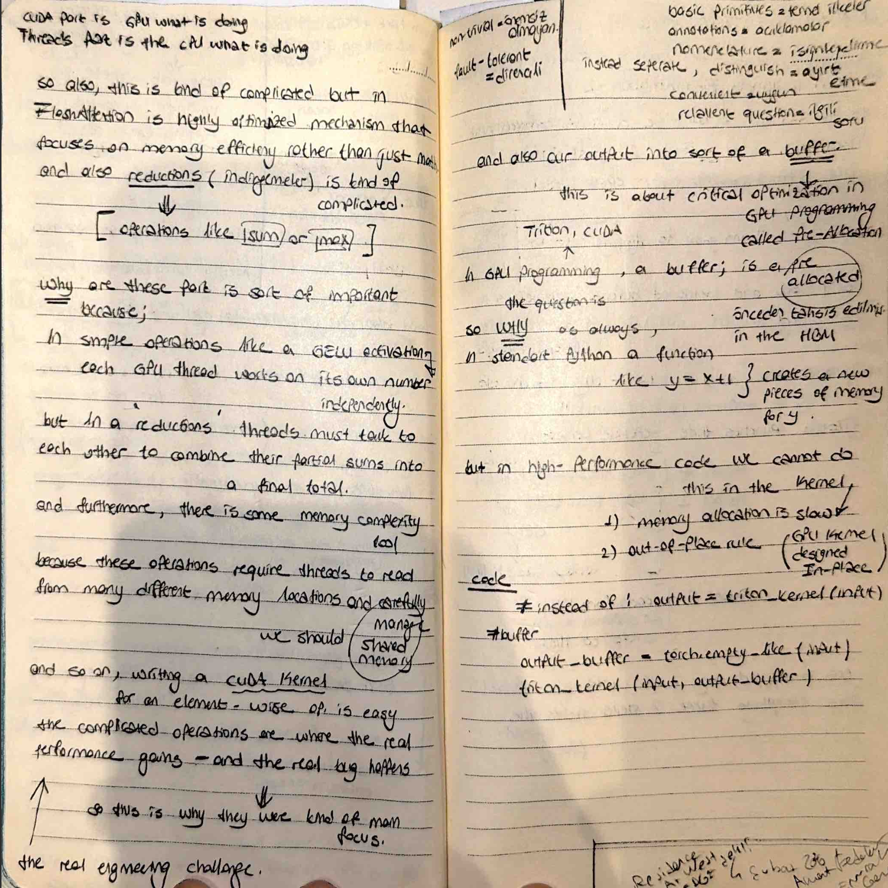

# GPU Reductions & The Pre-allocation Rule

Today, I explored the "complicated" world of GPU reductions and a critical optimization called Pre-allocation. I documented why simple math is easy, but combining results across threads is where the real engineering challenge lies.

##  My Notes

##  The Reduction Challenge (Sum/Max)
I realized that simple element-wise operations (like GELU) are easy because each thread works independently. However, **Reductions** (like $Sum$ or $Max$) are complicated.
- **Communication:** Threads must "talk" to each other to combine partial sums into a final total.
- **Memory Complexity:** These operations require threads to read from many different memory locations simultaneously, requiring careful **Shared Memory** management to avoid bottlenecks.

##  Critical Optimization: Pre-Allocation (Buffers)
I documented a "Gold Standard" rule in GPU programming: **Avoid dynamic memory allocation inside the training loop**.
- **The Problem:** In standard Python, a function like `y = x + 1` creates a brand new piece of memory for `y` every time it runs. This is slow.
- **The Solution:** We pre-allocate a **Buffer** in the HBM (Main Memory) before we start. 
- **The In-place Rule:** High-performance kernels are designed to be **In-place**. Instead of `output = kernel(input)`, we use `kernel(input, output_buffer)`.