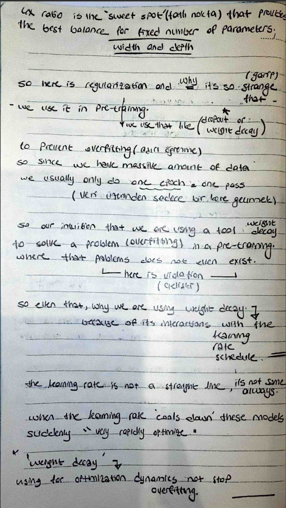

# Weight Decay - Not Just for Overfitting

## 📸 My Notes

Today, I revisited the intuition behind regularization in Large Language Models. While commonly used to prevent overfitting (aşırı öğrenme), I documented a counter-intuitive violation of this rule in the LLM pre-training phase.

## The Counter-Intuitive Truth
In pre-training, we usually only do **one epoch** (one pass over the data). Mathematically, overfitting doesn't even exist in this scenario, yet we still use tools like weight decay. 

- **Why use Weight Decay?** It's not about stopping overfitting; it's about **optimization dynamics**.
- **The LR Interaction:** Weight decay interacts deeply with the **Learning Rate Schedule**.
- **The Cooldown Effect:** When the learning rate "cools down" (the cosine decay phase), the model suddenly optimizes very rapidly. 
- **The Secret Job:** Weight decay ensures that the weights are in a "special dynamic" range, allowing the model to find a better final training loss than it would without it.

## Key Takeaway
Weight decay is a secret tool for training stability and final performance, acting as a partner to the learning rate rather than just a regularizer.