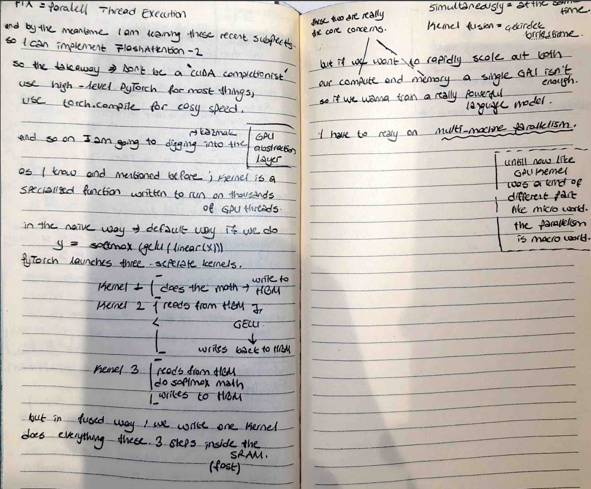

# PTX, Triton & Multi-Machine Scaling

For the final part of this series, I explored the abstraction layers of GPUs and the "Macro World" of parallelism. I documented the transition from single-kernel efficiency to massive multi-machine scaling.

##  My Notes

##  The GPU Abstraction Layer
I learned about **PTX (Parallel Thread Execution)**, the low-level intermediate language for NVIDIA GPUs.
- **The Takeaway:** Don't be a "CUDA completionist." For most tasks, use high-level PyTorch or **`torch.compile`** for "easy speed."

##  Naive vs. Fused (The Kernel Level)
I analyzed the "Micro World" of a GPU kernel:
- **Naive Way:** $y = \text{softmax}(\text{gelu}(\text{linear}(x)))$ launches **three separate kernels**, each writing back to the slow HBM.
- **Fused Way:** We write **one single kernel** that does all three steps inside the fast SRAM. This is the "FlashAttention" philosophy.

##  The "Macro World": Multi-Machine Parallelism
I identified the ultimate limit: A single GPU is not enough for powerful language models.
- **The Core Concern:** To rapidly scale both compute and memory, I must rely on **Multi-machine parallelism**.
- **The Paradigm Shift:** Until now, I focused on the "Micro World" of threads. Now, I am looking at the "Macro World" of connecting hundreds of GPUs to train a single "remarkable" model.